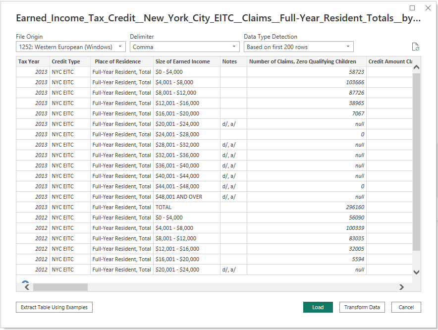
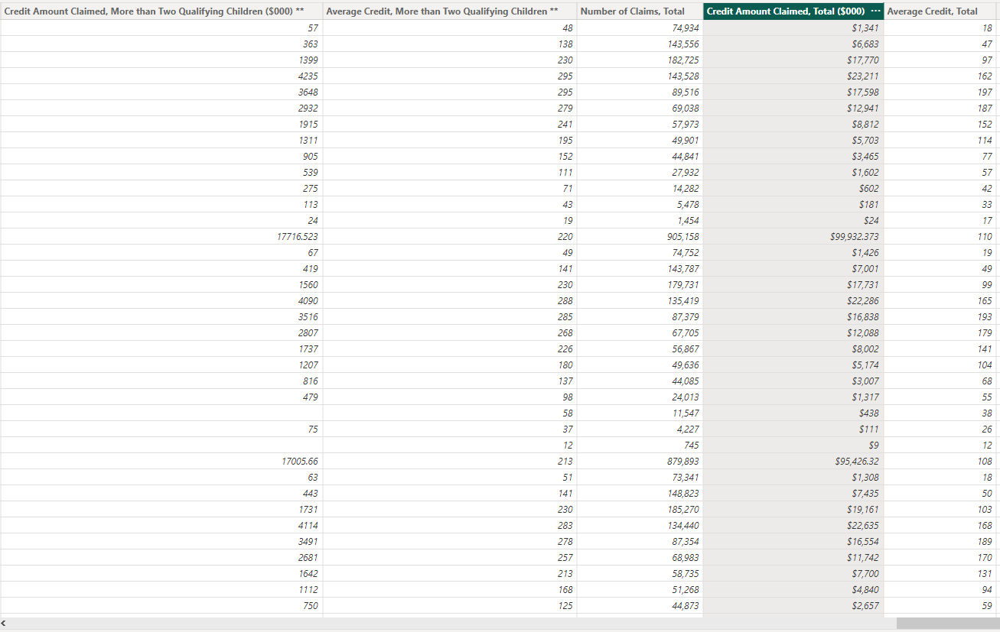

# Examining NYC's Earned Income Tax Credit: A 10-Year Overview

## Resources
Data source: Earned_Income_Tax_Credit__New_York_City_EITC__Claims__Full-Year_Resident_Totals__by_Size_of_Earned_Income.csv

Software: Microsoft Power BI Desktop 2.116.622.0

## Project Objective
### Use the provided csv file to create a dashboard to tell the best possible data driven story.

## Processing and Visualization
After inspecting the raw csv file, I connected it to Power BI as a text file. 

Upon careful inspection, I determined that the majority of the data was imported without any issues. However, I did need to perform some data manipulation, including the proper categorization of several columns and the implementation of comma separators to enhance readability.

### Please watch the video below demonstrating how to navigate the dashboard

<iframe width="980" height="500" src="https://www.youtube.com/embed/pBy1zgt0XPc" title="YouTube video player" frameborder="0" allow="accelerometer; autoplay; clipboard-write; encrypted-media; gyroscope; picture-in-picture; web-share" allowfullscreen></iframe>

<a href="https://app.powerbi.com/view?r=eyJrIjoiYTIyM2M3ZmYtN2Q0Ny00YTc1LWI3MWUtYmE3YjY2YWY4YWE0IiwidCI6ImRiMTUyMWRlLTEwYTYtNGIzNC05MDJiLTc4NGNiMmEyNjM5OCIsImMiOjZ9" target="_blank">View the Dashboard on the web</a>

## Drawing Insights

1. With the exception of a dip in 2008, the overall trend indicates a steady rise in the total number of claims filed, the total credit amount claimed, and the total average credit, from 727,814 claims and $64,737 total credit amount claimed in 2004 to 916,857 claims and $103,266 total credit amount claimed in 2014, with the total average credit increasing from 89 in 2004 to 113 in 2014. The dip observed in 2008 may be attributed to the global financial crisis that occurred during that time. The crisis had a profound impact on both individuals and families, as well as the economy at large.
2. The report includes a slicer located in the top right corner that enables users to select a year of interest. Once selected, the top three charts will update accordingly to provide insight into the relationship between income level brackets and earned income tax credit (EITC) claim data. 
   - The first chart, positioned on the left, displays the total number of claims versus income level brackets, with the $4,001-$8,000 and $8,001-$12,000 brackets generally showing the highest number of claims overall. One possible reason that these income level brackets generally show the highest number of claims overall is that these income levels may be the most common among eligible taxpayers in the population. Additionally, the Earned Income Tax Credit (EITC) is designed to provide assistance to low-to-moderate income working individuals and families, and those falling into these income level brackets may be more likely to qualify for the credit.
   - The second chart, located in the center, showcases the total credit amount claimed versus income level bracket, with the $8,001-$12,000 and $12,001-$16,000 brackets generally displaying the highest total credit amount claimed. Similar to the first chart, these brackets are in the low-to-moderate income range where many individuals and families qualify for the earned income tax credit (EITC).
   - Lastly, the third chart positioned on the right illustrates the total average credit versus income level bracket, with the $12,001-$16,000 and $16,001-$20,000 brackets typically having the highest average credit. One possible reason is that households within these income ranges may have higher numbers of qualifying dependents or may have incurred higher expenses related to dependent care or work-related expenses, which can increase the credit amount. Additionally, households in these income ranges may be more likely to have access to tax preparation services that can help them maximize their credit eligibility.

---
Return to the [Homepage](https://kenlo94.github.io/)
